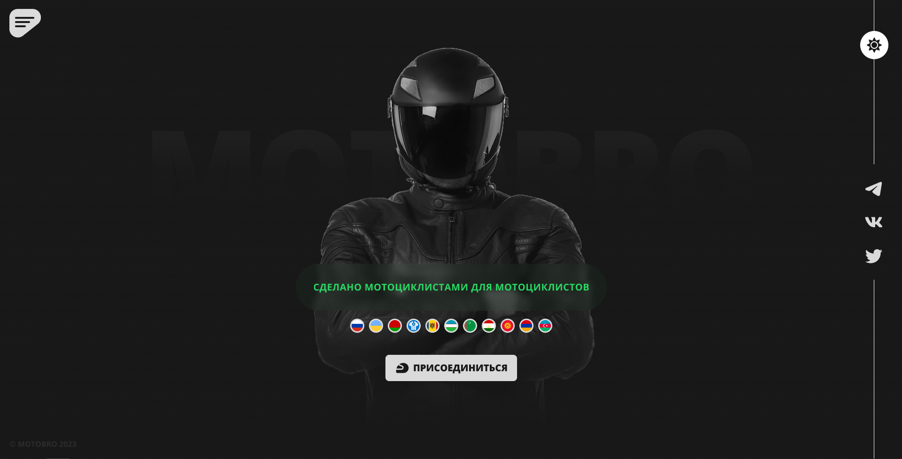

 

  

  

    Сделано мотоциклистами для мотоциклистов!
     
     
  

  

<pre>
    
</pre>
## О проекте

MOTOBRO — проект, который поможет сделать вашу мотожизнь лучше и комфортнее.

Функционал мотопортала огромен. Мы — это непросто сайт, это **целая экосистема**:

* Личный онлайн-гараж
* Мотофорум
* Мотонавигатор
* Мотокалендарь
* ...

## Лицензия

Распространяется под лицензией MIT. Смотрите [LICENSE](https://mit-license.org/) для большей информации.

## Разработчики

* **Евгений Козлов** - *GRIZLI-RGB* - [Евгений Козлов](https://github.com/GRIZLI-RGB/) - *Team Leader, Frontend Developer, Designer*
* **Куаныш Кирейбаев** - *Yamemik* - [Куаныш Кирейбаев](https://github.com/Yamemik) - *Backend Developer*